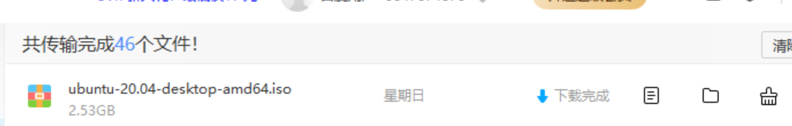
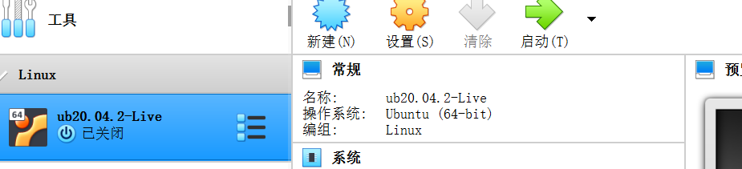
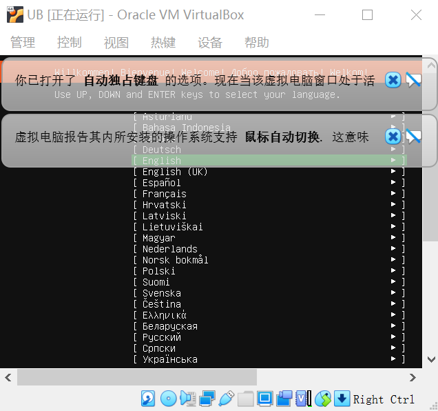
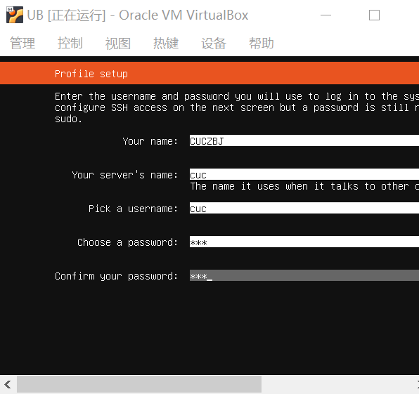
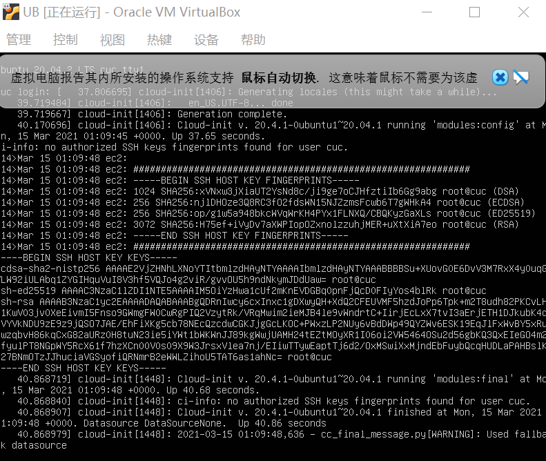
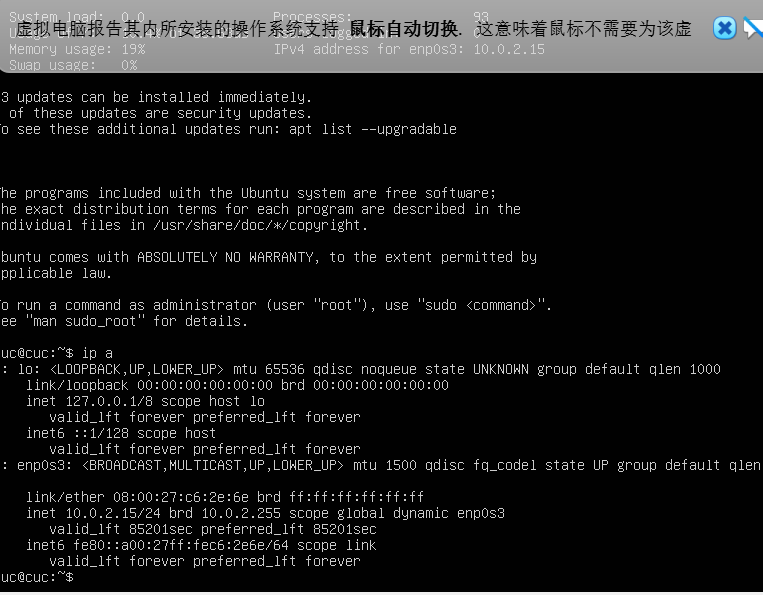
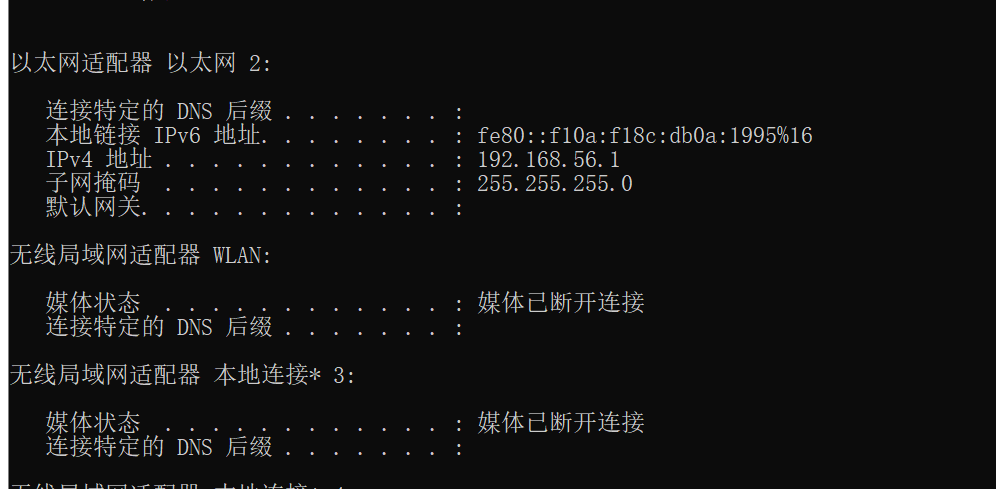

# Ubuntu20.04系统的无人值守安装

##### 1.下载 ubuntu-20.04.2-live-sever-amd64.iso 的文件（官网下载太慢了，所以我在百度网盘上下了一个）

- 

##### 2.安装

新建虚拟机，将虚拟机大小设置为动态80G，将网卡设置为host only

- 

##### 3启动

选择

- 

一直选done

- 

安装完成

- 

之后查看其ip地址

- 

###### 查看主机的IP地址

- 

然后将虚拟机与主机连接

